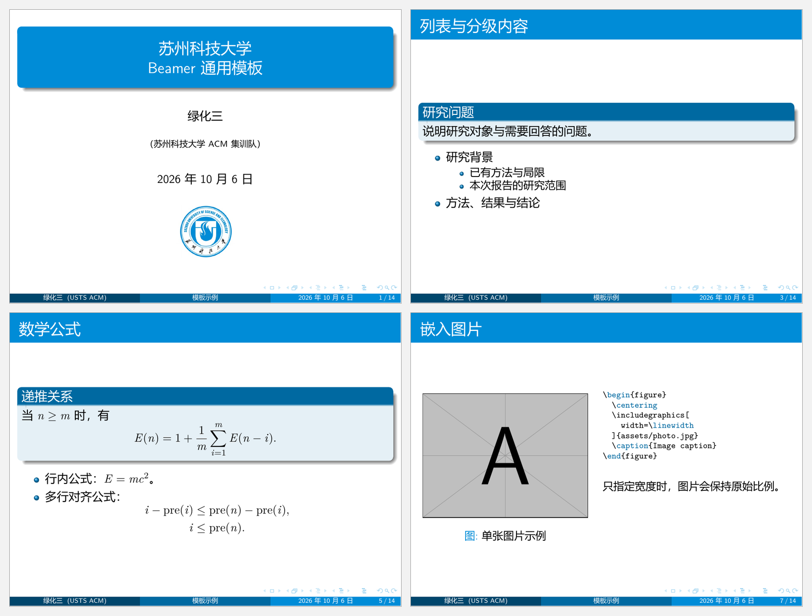

# USTS Beamer Theme

[](https://github.com/greenthree/usts-beamer-theme/actions/workflows/build.yml)

面向苏州科技大学师生的非官方 Beamer 模板，适用于课程汇报、学术报告、项目展示和竞赛讲解。



## 主题特点

主题基于 **Madrid**，采用学校蓝与衬线数学字体。

- 默认 4:3 比例、11pt 字号，支持通过文档类选项选择 16:9。
- 主色为 `RGB(0,140,215)`，即 `#008CD7`。
- 圆角阴影封面、通栏标题、球形项目符号和圆角阴影信息块。
- 三个等宽页脚栏，分别显示作者与单位、报告简称、日期与页码。
- 普通信息块和提醒块采用蓝色，示例块采用 Madrid 默认绿色。
- 封面仅放置居中的校徽，可按报告用途替换。
- 提供可直接填写的报告模板与常用语法示例。

默认作者为「绿化三」，封面单位显示为「（苏州科技大学 ACM 集训队）」，页脚简写为 `USTS ACM`。

## 快速开始

下载或克隆仓库，以 [`template.tex`](template.tex) 开始制作报告。[`example.tex`](example.tex) 提供完整语法示例，可按需复制其中的页面。

主题文件、`.tex` 文件和 `assets/` 应位于同一目录。导言区的关键设置如下：

```tex
\documentclass{beamer}
\usetheme{USTS}
\usepackage{ctex}
\usepackage[T1]{fontenc}
\usepackage{graphicx}

\title[报告简称]{苏州科技大学\\报告标题}
\author[绿化三]{绿化三}
\institute[USTS ACM]{（苏州科技大学 ACM 集训队）\\\medskip}
\date{\today}
```

中文模板使用 **XeLaTeX**，CI 也使用该引擎。不支持使用 pdfLaTeX 编译这两份中文文档。

```bash
latexmk -xelatex -interaction=nonstopmode -halt-on-error template.tex
latexmk -xelatex -interaction=nonstopmode -halt-on-error example.tex
```

也可以在编辑器中选择 XeLaTeX，至少编译两次，使页码与目录收敛。

## 封面

封面标识位于标题信息之后的独立 `figure` 中：

```tex
\begin{frame}
  \titlepage
  \begin{figure}[htbp]
    \begin{center}
      \includegraphics[scale=0.18]{assets/usts-logo.jpg}
    \end{center}
  \end{figure}
  \vspace{25pt}
\end{frame}
```

如需使用其他标识，可将 `assets/usts-logo.jpg` 替换为相应素材，并按图片比例调整缩放设置。

封面标题建议不超过两行，单位信息建议写成一行。增加副标题或多行作者时，请相应调整图片及留白，避免封面超高。

## 常用语法

`example.tex` 包含分级列表、普通块、提醒块、示例块、数学公式、三线表、图片、图文双栏、裁剪、定义与定理、证明、覆盖层、Python 代码及超链接。

嵌入图片：

```tex
\begin{figure}
  \centering
  \includegraphics[width=0.7\linewidth]{assets/photo.jpg}
  \caption{图片说明}
\end{figure}
```

只指定宽度或高度时，图片会保持原比例。裁剪顺序为左、下、右、上，默认单位为 bp，裁剪时必须加 `clip`：

```tex
\includegraphics[
  width=\linewidth,
  trim=25 20 25 20,
  clip
]{assets/photo.jpg}
```

含 `lstlisting` 的页面使用 `\begin{frame}[fragile]`。示例图片 `example-image-a`、`example-image-b` 来自 TeX Live 的 `mwe` 宏包，正式报告中应替换为自己的图片。

## 自定义

主题使用标准 Beamer 接口。选择宽屏比例时，在文档类中设置：

```tex
\documentclass[aspectratio=169]{beamer}
```

比例变化会影响封面的可用高度，需重新检查图片与留白。导航图标、页脚、颜色和字体可在 `\usetheme{USTS}` 之后调整：

```tex
\setbeamertemplate{navigation symbols}{}   % 隐藏导航图标
\setbeamertemplate{footline}{}             % 隐藏页脚
\setbeamertemplate{footline}[frame number] % 仅显示页码

\setbeamercolor{alerted text}{fg=USTSBlue!75!black}
\setbeamerfont{frametitle}{size=\Large}
```

Madrid 页脚不自动缩小或截断文字。标题、作者或日期较长时，使用短元数据避免三栏溢出：

```tex
\title[项目汇报]{完整的项目研究与成果汇报标题}
\author[绿化三等]{绿化三 \and 李四 \and 王五}
\institute[USTS ACM]{（苏州科技大学 ACM 集训队）\\\medskip}
\date[2026-10]{2026 年 10 月}
```

未设置单位或显式写 `\institute[]{完整单位}` 时，页脚不显示空括号。只写 `\institute{完整单位}` 时，Beamer 会同时将完整单位用于页脚。

主题不自动插入目录或章节过渡页。封面默认参与 frame 计数，覆盖层共用 frame 编号。若要隐藏某页的页眉页脚且不计数，使用 `[plain,noframenumbering]`。

### 字体

模板使用 `ctex`、`T1` 西文字体编码及 `onlymath` 衬线数学字体设置。中文字体由 `ctex` 按系统选择：Windows 通常使用微软雅黑，Linux 通常使用 Fandol。跨操作系统、字体版本或 Beamer 版本时，字形与换行可能不同。

## 排版测试

安装 XeLaTeX、latexmk、Python 3 与 Poppler（`pdftoppm`、`pdftotext`），然后运行：

```bash
python tests/check_layout.py
```

脚本分别编译 4:3、16:9 测试文档，检查标题、空单位、页脚和页面边界，并在 **144 dpi** 下与独立 Madrid 基准配置逐页比较像素。两种比例各覆盖 11 页，输出位于被忽略的 `build/layout/`。

CI 编译 `template.tex`、`example.tex`，运行排版测试，并上传 PDF。

## 文件结构

```text
.
├── beamerthemeUSTS.sty       # 主题布局与数学字体
├── beamercolorthemeUSTS.sty  # 颜色配置
├── template.tex             # 可直接填写的报告模板
├── example.tex              # 常用语法示例
├── preview.png
├── assets/
│   ├── usts-logo.jpg
│   └── README.md
├── tests/
│   ├── regression.tex
│   └── check_layout.py
└── .github/workflows/build.yml
```

## 许可与声明

主题代码以 [MIT License](LICENSE) 开源。Madrid 及其他 Beamer 组件直接使用 TeX 发行版中的实现，其许可归各自项目管理。

本项目为非官方模板，与苏州科技大学官方无隶属或授权关系。学校名称、校徽等权利归各自权利人所有，素材不因项目采用 MIT License 而改变其权利归属。使用者应遵守相应视觉标识规范。

---

Unofficial Beamer theme for Suzhou University of Science and Technology (USTS), based on Madrid with school-blue accents. Compile the Chinese documents with XeLaTeX.
